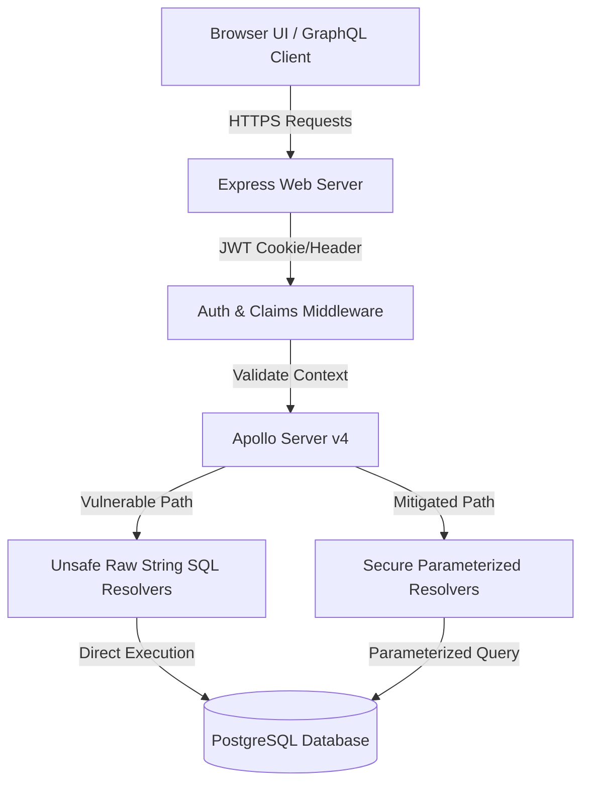

# Damn Vulnerable GraphQL Application (DVGA) - Node.js Edition

[](https://opensource.org/licenses/MIT)
[](https://www.docker.com/)

> [!WARNING]
> **DELIBERATELY VULNERABLE - EDUCATIONAL USE ONLY**
> This application contains intentionally vulnerable code modules representing critical web API flaws. 
> * **DO NOT deploy this application to public networks or production servers.**
> * **Run ONLY in secure, isolated environments (e.g. local machines or offline Docker containers).**

---

## Introduction

**DVGA-Node** is a Node.js-native evolution of the Damn Vulnerable GraphQL Application (DVGA). Built using **Express.js**, **Apollo Server 4**, and **PostgreSQL (via raw pg)**, it provides security engineers, developers, and pentester training labs with an interactive sandbox to discover, exploit, and remediate GraphQL vulnerability modules.

Unlike automated templates, this lab offers **runtime security toggles** (Vulnerable vs Mitigated) and **side-by-side resolver source comparisons** directly in the UI.

---

## Key Features & Vulnerabilities

| ID | Module | Severity | Category | Difficulty |
|---|---|---|---|---|
| 01 | **BOLA (Broken Object Level Auth)** | Critical | Authorization | Easy |
| 02 | **IDOR (Direct Object References)** | High | Authorization | Easy |
| 03 | **Weak JWT Validations** | Critical | Authentication | Medium |
| 04 | **Broken Access Control** | High | Authorization | Easy |
| 05 | **SQL Injection (SQLi)** | Critical | Injection | Medium |
| 06 | **Stored XSS** | High | Cross-Site Scripting | Easy |
| 07 | **SSRF (Request Forgery)** | High | Server-Side Request | Medium |
| 08 | **Brute Force Login** | Medium | Authentication | Easy |
| 09 | **Command Execution Risks** | Critical | Injection | Hard |
| 10 | **GraphQL Introspection Exposure** | Low | Info Disclosure | Easy |
| 11 | **Excessive Data Exposure** | Medium | Info Disclosure | Easy |
| 12 | **Field-Level Auth Failure** | Medium | Authorization | Easy |
| 13 | **Sensitive Error Leakage** | Low | Info Disclosure | Easy |
| 14 | **Insecure File Upload** | High | File Handling | Medium |
| 15 | **Weak Password Policy** | Medium | Authentication | Easy |
| 16 | **Broken Authentication** | Critical | Authentication | Medium |
| 17 | **Broken Object Property Level Authorization** | Critical | Authorization | Medium |
| 18 | **Broken Function Level Authorization** | Critical | Authorization | Easy |
| 19 | **Unrestricted Access to Sensitive Business Flows** | Critical | Business Logic | Medium |


---

## Architectural Flow Diagram



---

## Installation & Setup

### Option 1: Docker Compose (Preferred)

Clone the repository and spin up isolated container instances. The application will self-bootstrap, creating the tables and seeding standard credentials:

```bash
# Build and run containers
npm run docker:run
```
The application will launch at:
* **Web UI panel & Sandbox:** [http://localhost:5013/](http://localhost:5013/)
* **GraphQL endpoint:** [http://localhost:5013/graphql](http://localhost:5013/graphql)

### Option 2: Local Node.js Development

Ensure a **PostgreSQL** instance is running locally.

1. **Install dependencies:**
   ```bash
   npm install
   ```

2. **Configure environment (.env):**
   Copy the example settings and update PostgreSQL details:
   ```bash
   cp .env.example .env
   ```

3. **Initialize Database:**
   Construct schema and seed database files:
   ```bash
   npm run db:setup
   ```

4. **Start Application Server:**
   Launch with hot-reload support:
   ```bash
   npm run dev
   ```

---

## Training Credentials

Use the preconfigured credentials for testing authorization boundaries. Switching profiles is built directly into the UI header dropdown:

* **Administrator:** `admin@lab.local` / `Admin123!`
* **User A (Alice):** `user_a@lab.local` / `User123!`
* **User B (Bob):** `user_b@lab.local` / `User123!`

---

## Learning Modes

* **Beginner Mode:** UI shows full vulnerability overviews, step-by-step black-box testing guidelines, copyable GraphQL payloads, and side-by-side source code comparisons.
* **Expert Mode:** Hides clues and source code references, forcing students to discover endpoints using native schema mapping and penetration testing techniques.

---

## Repository Structure

```
├── /docs                 # Detailed vulnerability research and guidelines
├── /server
│   ├── config.js         # Runtime server state configurations
│   ├── server.js         # Express app entrypoint & API uploads
│   ├── /database
│   │   ├── db.js         # pg client pool definition
│   │   ├── schema.sql    # Table schema setups
│   │   ├── seed.sql      # Seed insert values
│   │   └── init.js       # Auto-initialization migrations script
│   ├── /graphql
│   │   ├── typeDefs.js   # API Type schema definitions
│   │   └── resolvers.js  # Splitted vulnerable vs secure query resolvers
│   ├── /middleware
│   │   └── auth.js       # JWT checking middleware
│   ├── /modules
│   │   ├── cmd.js        # Command execution helper (Windows sandbox)
│   │   ├── ssrf.js       # SSRF requests checking helper
│   │   └── upload.js     # Base64 files storing helper
│   └── /public           # Frontend SPA client files (index.html, style.css, app.js)
├── Dockerfile            # Container build configurations
└── docker-compose.yml    # App + Postgres service network definition
```

---

## Security Notice

This application contains active, high-risk security vulnerabilities. Always host inside firewalled networks and stop processes after exercises have completed.

## Screenshot Example

Here’s a screenshot of the web page demonstrating the deployment:


## Resources

- [GraphQL Security – PortSwigger Web Security Academy](https://portswigger.net/web-security/graphql)
- [Learn GraphQL – Official Documentation](https://graphql.org/learn/)
- [Damn Vulnerable GraphQL Application – GitHub](https://github.com/dolevf/Damn-Vulnerable-GraphQL-Application)
- Additional resources to learn about GraphQL and its vulnerabilities can be added here.
